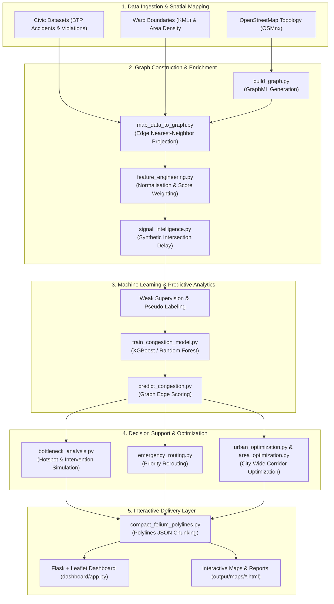

# 🚦 Traffic Optimiser: Graph-Based Urban Congestion Modeling & Intelligent Traffic Routing

[](https://www.python.org/downloads/)
[](https://opensource.org/licenses/MIT)
[](https://osmnx.readthedocs.io/)
[](https://xgboost.readthedocs.io/)
[](https://python-visualization.github.io/folium/)

A comprehensive, end-to-end urban traffic analysis, modeling, and optimization platform focused on complex metropolitan road networks (exemplified on Bengaluru, India).

The system integrates **OpenStreetMap road topology**, **civic traffic datasets**, **topology-aware signal delay intelligence**, **weakly-supervised machine learning**, and **multi-objective graph optimization algorithms** to identify bottlenecks, dynamically re-route emergency vehicles, simulate urban interventions, and serve interactive visual analytics.

---

## 📌 Executive Summary & Architecture



---

## ✨ Key Capabilities

| Module | Functionality | Primary Outputs |
| :--- | :--- | :--- |
| 🗺️ **Graph Construction** | Extracts road network topology (nodes, edges, speed limits, lane counts) from OpenStreetMap. | `bangalore_graph.graphml`, `road_network.html` |
| 📊 **Spatial Enrichment** | Projects external geo-tagged civic datasets (accidents, citations, enforcement) onto nearest network edges. | `bangalore_graph_enriched.graphml` |
| 🚥 **Signal Intelligence** | Estimates junction delays using topological node degree, centrality metrics, and local road density. | `bangalore_signalized.graphml` |
| 🤖 **Weakly-Supervised ML** | Trains predictive ensemble models (XGBoost/Random Forest) using pseudo-labels for edge-level congestion scoring. | `congestion_model.pkl`, `model_evaluation.txt` |
| 🚨 **Emergency Routing** | Computes optimal priority corridors for emergency vehicles by balancing distance, travel time, and congestion. | `emergency_route.html`, `emergency_analysis.csv` |
| 🔍 **Bottleneck & Hotspot Analysis** | Identifies critical gridlocks, assesses network resilience, and evaluates scenario interventions. | `hotspots.csv`, `bottlenecks.csv`, `intervention_map.html` |
| ⚡ **City-Wide Optimization** | Simulates corridor rerouting, adaptive traffic signal timing, and demand management strategies. | `optimization_comparison.html`, `urban_optimization_report.txt` |
| 💻 **Interactive Dashboard** | Flask web app providing interactive side-by-side comparison of baseline vs. optimized routes. | `http://localhost:5050` |

---

## 🔍 Data Source & Modeling Transparency

> [!IMPORTANT]
> To maintain academic and practical rigor, every dataset and feature used in this repository is explicitly classified by its provenance:

* **Real Measured Data**:
  * **Road Network Topology**: Downloaded directly from OpenStreetMap (`OSMnx`) including edge geometry, length, highway classifications, and intersection nodes.
  * **Civic Datasets**: Bengaluru Traffic Police (BTP) incident records, violation stats, and ward boundary geometry (`KML`).
* **Proxy Data**:
  * **Traffic Density**: Aggregated area-level density estimates derived from `Banglore_traffic_Dataset.csv` and projected to road segments via fuzzy spatial matching.
* **Topology-Derived Synthetic Estimations**:
  * **Intersection Delay**: Calculated from topological features (node degree, betweenness centrality, and incoming edge capacity).
  * **Temporal & Weather Features**: Synthetic feature distributions used to facilitate model training in the absence of continuous IoT sensor streams.
* **Weak Supervision (Pseudo-Labeling)**:
  * The target label `congestion_score` is generated using a formula-derived pseudo-label. Output metrics indicate **relative congestion risk and prioritization rankings** rather than physical vehicle counts.

---

## 📁 Repository Structure

```
traffic-optimiser/
├── dashboard/                  # Interactive Flask + Leaflet Web Application
│   ├── app.py                  # Web server & API routing
│   └── templates/
│       └── index.html          # Web UI layout & map canvas
├── data/                       # Civic datasets (CSV & KML input files)
├── output/                     # Generated pipeline outputs & artifacts
│   ├── graphs/                 # GraphML representations (.graphml)
│   ├── maps/                   # Interactive Leaflet HTML maps
│   ├── models/                 # Serialized Machine Learning models (.pkl)
│   └── reports/                # Analytical reports, summary CSVs & charts
├── scripts/                    # Helper shell scripts
│   ├── cleanup_project.sh      # Project cleanup utility
│   └── run_sumo_gui.sh         # SUMO X11 GUI launcher for macOS
├── src/                        # Core Python Pipeline Code
│   ├── area_optimization.py    # Sub-zone corridor & area optimization
│   ├── bottleneck_analysis.py  # Hotspot identification & intervention testing
│   ├── build_graph.py          # OSM network downloader & builder
│   ├── compact_folium_polylines.py # Large HTML map optimization engine
│   ├── config.py               # Global settings, paths & hyper-parameters
│   ├── congestion_optimizer.py # Multi-algorithm city optimization engine
│   ├── emergency_routing.py    # Priority emergency vehicle routing engine
│   ├── feature_engineering.py  # Feature extraction & score normalizer
│   ├── map_data_to_graph.py    # Spatial nearest-neighbor dataset projection
│   ├── predict_congestion.py   # Machine learning inference on graph edges
│   ├── run_pipeline.py         # Orchestrator / master pipeline runner
│   ├── signal_intelligence.py # Topology-based intersection delay estimator
│   ├── train_congestion_model.py # ML model training & evaluation
│   ├── urban_optimization.py  # City-level resilience & policy analytics
│   └── utils.py                # Graph helpers, distance & IO utilities
├── simulate_traffic.py         # Microscopic traffic simulation interface
├── requirements.txt            # Python dependencies
└── README.md                   # System documentation
```

---

## 🚀 Installation & Setup

### 1. Prerequisites
Ensure you have **Python 3.9+** installed on your system.

### 2. Create Virtual Environment
```bash
# Clone the repository
git clone https://github.com/AditiAgarwal1706/traffic-optimiser.git
cd traffic-optimiser

# Initialize virtual environment
python3 -m venv .venv
source .venv/bin/activate

# Upgrade pip & install requirements
python -m pip install --upgrade pip
pip install -r requirements.txt
```

> [!TIP]
> **Geospatial Dependency Note (macOS / Linux)**:
> This project uses `geopandas`, `shapely`, `fiona`, and `pyproj`. On macOS, ensure Xcode Command Line Tools are installed (`xcode-select --install`). If C-extension compilation errors occur, consider installing geospatial binaries via Conda (`conda install -c conda-forge geopandas osmnx`).

---

## 💻 Interactive Dashboard

The repository includes a web-based decision support dashboard built with **Flask** and **Leaflet.js**.

### Running the Dashboard:
```bash
source .venv/bin/activate
python dashboard/app.py
```

Access the dashboard in your web browser at:
👉 **`http://localhost:5050`**

### Features:
* 🗺️ Interactive dual-layer map rendering.
* 🚦 Baseline vs. Optimized Route comparison for any origin/destination pair.
* ⚡ Real-time display of travel time savings, congestion index reduction, and distance metrics.

---

## 🔄 Running the Pipeline

You can execute the entire modeling pipeline end-to-end or run individual steps modularly using `src/run_pipeline.py`.

### Run Full Pipeline
```bash
python src/run_pipeline.py
```

### Resume / Modular Execution
```bash
# Resume execution from Step 4 (Signal Intelligence)
python src/run_pipeline.py --from 4

# Run ONLY Step 7 (Bottleneck Analysis)
python src/run_pipeline.py --only 7
```

### Pipeline Step Reference

| Step # | Script Module | Description |
| :---: | :--- | :--- |
| **1** | `src/build_graph.py` | Downloads OpenStreetMap network & generates base `bangalore_graph.graphml` |
| **2** | `src/map_data_to_graph.py` | Projects geo-spatial incidents & ward boundaries onto graph edges |
| **3** | `src/feature_engineering.py` | Computes normalized traffic density, risk, and structural weight features |
| **4** | `src/signal_intelligence.py` | Estimates junction & signal delay factors across intersections |
| **5** | `src/train_congestion_model.py` | Trains XGBoost/Random Forest models on weak supervision pseudo-labels |
| **6** | `src/predict_congestion.py` | Performs inference and annotates all graph edges with ML congestion scores |
| **7** | `src/bottleneck_analysis.py` | Detects bottlenecks, identifies hotspots, and runs scenario simulations |
| **8** | `src/emergency_routing.py` | Calculates emergency corridors and computes time vs. congestion trade-offs |
| **9** | `src/urban_optimization.py` | Generates urban resilience metrics, ward-level stats, and policy reports |

---

## 🏙️ Standalone Optimization Engine

To run city-level multi-algorithm traffic optimization (adaptive signal timing, corridor rerouting, and demand management):

```bash
python src/congestion_optimizer.py
```

**Key Outputs**:
* `output/maps/optimization_comparison.html`
* `output/maps/algorithm_comparison.html`
* `output/reports/optimization_report.txt`

---

## 🚀 Performance Engine: Compact Folium Polylines

Rendering high-density urban road networks (100,000+ edges) in Folium maps can cause browser slowdowns due to massive HTML DOM size. 

This repository includes a custom rendering optimization utility (`src/compact_folium_polylines.py`) that decouples map geometry into compressed JSON chunks loaded asynchronously via JavaScript `fetch()`.

### Compacting Large Maps:
```bash
python src/compact_folium_polylines.py \
  output/maps/optimization_comparison.html \
  --max-polylines 20000 \
  --select sample \
  --seed 7 \
  --color-scheme bin3 \
  --html-out output/maps/optimization_comparison.compact.html \
  --data-out output/maps/optimization_comparison.compact.polylines.json
```

> [!NOTE]
> Compact HTML files use asynchronous `fetch()` requests to load polyline data. Serve the output directory locally via Python's HTTP server to view:
> ```bash
> python -m http.server 8000
> # Open http://localhost:8000/output/maps/optimization_comparison.compact.html
> ```

---

## 🚦 (Optional) SUMO Microscopic Simulation

For micro-level vehicle traffic simulation using **Eclipse SUMO**:

1. Install **XQuartz** on macOS (required for X11 GUI rendering): [xquartz.org](https://www.xquartz.org/)
2. Launch SUMO GUI via the helper script:
```bash
./scripts/run_sumo_gui.sh
```
3. For headless simulation runs without GUI:
```bash
/Library/Frameworks/EclipseSUMO.framework/Versions/1.26.0/EclipseSUMO/bin/sumo \
  -c sumo/cfg/before_simulation.sumocfg \
  --no-step-log true
```

---

## 🛠️ Configuration & Customization

All pipeline settings, paths, random seeds, and hyper-parameters are central to `src/config.py`:

* `PLACE_NAME`: Change target city/region for OpenStreetMap download (default: `"Bengaluru, India"`).
* `NETWORK_TYPE`: OSM network filtering (`"drive"`, `"all"`, etc.).
* `MODEL_PARAMS`: XGBoost / Random Forest hyper-parameters and training seeds.
* `EMERGENCY_ROUTING`: Source & target coordinates for emergency priority tests.

---

## 📄 License & Disclaimer

* **License**: Open-source under the [MIT License](LICENSE).
* **Disclaimer**: This framework is designed for research, decision-support, and scenario prioritization. Outputs represent relative indicators based on topological, weak-supervision, and civic data inputs, and should be calibrated with physical sensor ground-truth prior to real-world infrastructure deployment.
